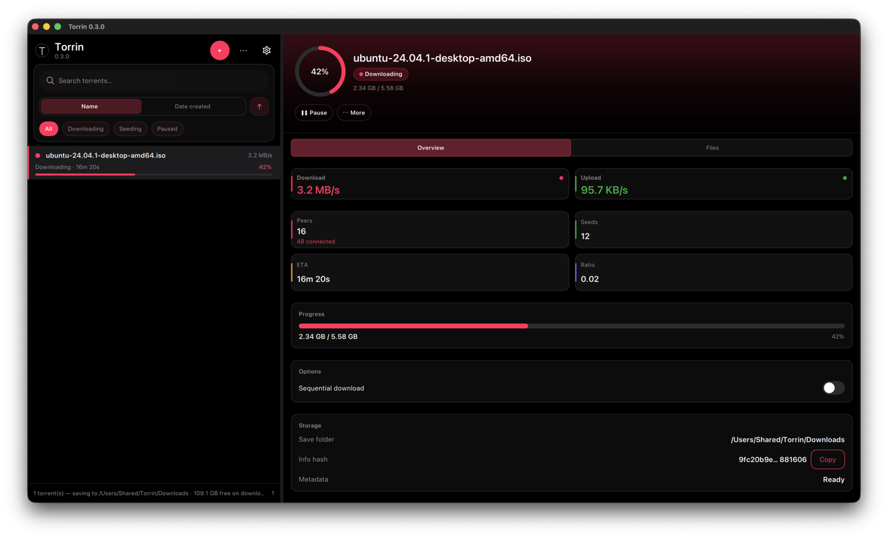

# Torrin

[](LICENSE)
[](https://github.com/dineshkn-dev/torrin/releases/latest)
[](docs/specs/PRODUCT.md)

**Torrin** is an open-source **BitTorrent client for macOS**, built with **Qt 6 Quick** and **libtorrent 2.x**: fast-resume, modern list UX, no ads, and no bundled telemetry ([ADR-003](docs/architecture/ADR-003-security.md)).

<p align="center">
  <a href="https://github.com/dineshkn-dev/torrin/releases/latest">
    
  </a>
</p>

<p align="center">
  
</p>
<p align="center">
  
</p>

## Why Torrin?

- **Native macOS app** — Qt Quick UI, not Electron; C++20 + libtorrent 2.x
- **Privacy-first** — no telemetry by default; settings and resume data stay on your Mac
- **Trustworthy releases** — signed `.dmg`, SHA-256 checksums, SPDX SBOM, cosign signatures
- **GPL-3.0** — inspectable source, no ads

## Features

- Magnet and `.torrent` add, pause, resume, remove, stop/resume seeding
- Search and sort list; filters; resizable master–detail UI
- File priorities, sequential download, force recheck / reannounce
- Bandwidth limits, port, DHT/UPnP, proxy; system light/dark theme
- Drag-and-drop, fast-resume, completion notifications

Details: [docs/specs/PRODUCT.md](docs/specs/PRODUCT.md). Roadmap: [docs/planning/FUTURE.md](docs/planning/FUTURE.md).

## Comparison (macOS)

| | Torrin | Transmission | qBittorrent |
|---|:---:|:---:|:---:|
| Open source (GPL) | Yes | Yes | Yes |
| Native Qt / non-Electron UI | Yes | — | — |
| Rich list UX (search, sort, ETA) | Yes | Basic | Yes |
| Signed release + SBOM | Yes | Varies | Varies |
| No bundled telemetry (default) | Yes | Yes | Yes |
| Windows / Linux builds | Planned ([roadmap](docs/planning/FUTURE.md#cross-platform)) | Yes | Yes |

Torrin is **macOS-only today**; Windows and Linux are on the [v1.1 milestone](docs/planning/FUTURE.md#cross-platform).

## Install

1. Download the latest **`.dmg`** from [Releases](https://github.com/dineshkn-dev/torrin/releases/latest).
2. Open the disk image and drag **Torrin** to **Applications**.
3. On first launch, if macOS blocks the app (unsigned or not notarized build), open **System Settings → Privacy & Security** and choose **Open Anyway**. [Notarized installs](docs/planning/FUTURE.md#production-macos) are planned for v1.0.

### Build from source

**Requirements:** CMake 3.24+, Ninja, C++20, Git, full **Xcode** on macOS.

```bash
brew install cmake ninja pkg-config autoconf autoconf-archive automake libtool
./scripts/bootstrap.sh
cmake --preset dev
cmake --build --preset dev
./scripts/run-dev.sh
```

Torrin follows macOS **Appearance** (Light / Dark / Auto). Optional: `export VCPKG_ROOT=~/vcpkg`.

## Architecture

- `torrin_core` — libtorrent session (no Qt)
- `torrin_models` — Qt models for QML
- `torrin` — Qt Quick app

See [docs/architecture/](docs/architecture/) and [AGENTS.md](AGENTS.md).

## Contributing

See [CONTRIBUTING.md](CONTRIBUTING.md) · [AGENTS.md](AGENTS.md) · [docs/CONVENTIONS.md](docs/CONVENTIONS.md)

## License

GPL-3.0-or-later — [LICENSE](LICENSE). libtorrent is BSD-licensed.

## Security

[SECURITY.md](SECURITY.md) — use Torrin only for content you have the right to download or share.
