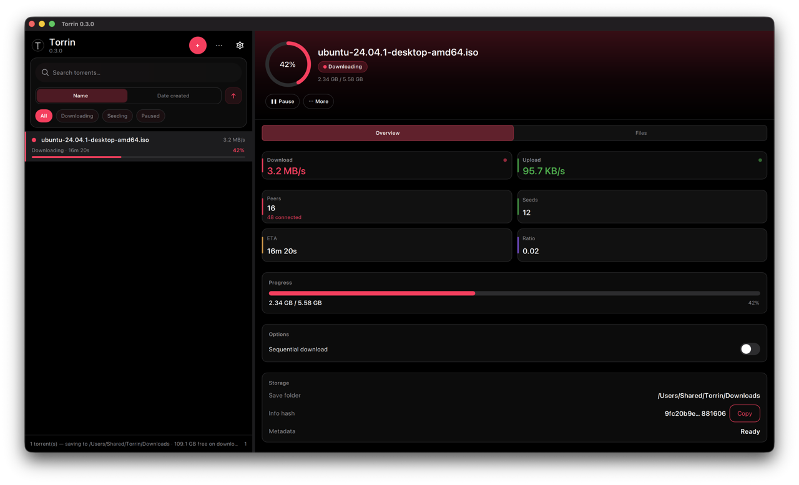

# Torrin

[](LICENSE)
[](https://github.com/dineshkn-dev/torrin/releases/latest)
[](https://github.com/dineshkn-dev/torrin/actions/workflows/ci.yml)

**Torrin** is a free, open-source **BitTorrent client** for **macOS**, **Windows**, and **Linux**. It uses a modern **Qt 6 Quick** interface and **libtorrent 2.x** on the engine side — no ads, no bundled telemetry, no account required.

**Website:** [dineshkn-dev.github.io/torrin](https://dineshkn-dev.github.io/torrin/) · **Download:** [latest release](https://github.com/dineshkn-dev/torrin/releases/latest)

<p align="center">
  <a href="https://github.com/dineshkn-dev/torrin/releases/latest">
    
  </a>
</p>

<p align="center">
  
</p>

## Contents

- [Features](#features)
- [Install](#install)
- [Why Torrin](#why-torrin)
- [FAQ](#faq)
- [Build from source](#build-from-source)
- [Architecture](#architecture)
- [Contributing](#contributing)
- [License](#license)

## Features

- Magnet and `.torrent` add, pause, resume, remove, stop/resume seeding
- Search, sort, filters, resizable master–detail UI
- File priorities, sequential download, force recheck / reannounce
- Bandwidth limits, port, DHT/UPnP, proxy; light/dark appearance
- Drag-and-drop, fast-resume, completion notifications
- Signed releases with SHA-256 checksums, SPDX SBOM, and cosign signatures

## Install

Download from **[Releases](https://github.com/dineshkn-dev/torrin/releases/latest)**:

| Platform | File | Notes |
|----------|------|--------|
| macOS | `.dmg` | Drag to Applications; use **Open Anyway** if Gatekeeper blocks |
| Windows | `.zip` (x64) | Run `torrin.exe` from the extracted folder |
| Linux | `.tar.gz` (x64) | Run `usr/bin/torrin` from the archive |

Verify with `SHA256SUMS.txt` and cosign files on the release page.

## Why Torrin

If you are looking for an **open-source torrent client** that is actively maintained, cross-platform, and respectful of your machine:

| | Torrin | Typical alternatives |
|---|--------|----------------------|
| **Stack** | Qt 6 Quick + libtorrent 2.x (C++20) | Varies (Qt, GTK, web UI, etc.) |
| **Platforms** | macOS, Windows, Linux (portable builds) | Often strong on one OS |
| **Privacy** | No ads, no bundled telemetry | Varies by client and build |
| **License** | [GPL-3.0-or-later](LICENSE) | Often GPL (e.g. Transmission, qBittorrent) |

Torrin is a good fit when you want a **desktop BitTorrent app** with a modern list/detail UI, magnet support, and reproducible open builds — without signing up for a service.

## FAQ

### What is Torrin?

Torrin is an open-source **BitTorrent / torrent client** for desktop. You add magnets or `.torrent` files, manage downloads and seeding, and control bandwidth and networking from a native app.

### Is Torrin free?

Yes. Torrin is **free and open source** under **GPL-3.0-or-later**. You can download binaries from [Releases](https://github.com/dineshkn-dev/torrin/releases/latest) or build from source.

### Which operating systems are supported?

**macOS**, **Windows** (x64), and **Linux** (x64 portable `.tar.gz`). See the [install table](#install) above.

### Does Torrin have ads or telemetry?

No ads and **no bundled telemetry** in official releases. The app talks to the BitTorrent network and your configured proxy only — see [SECURITY.md](SECURITY.md).

### How is Torrin different from Transmission or qBittorrent?

All three are GPL-family **open-source torrent clients**. Transmission and qBittorrent are mature and widely packaged; Torrin focuses on a **Qt 6 Quick** UI, **libtorrent 2.x**, and a small, auditable codebase with signed portable builds for all three desktop platforms. Pick the client that matches your workflow and trust model.

### Can I contribute or report bugs?

Yes — see [CONTRIBUTING.md](CONTRIBUTING.md). Use [GitHub Issues](https://github.com/dineshkn-dev/torrin/issues) for bugs and ideas.

## Build from source

```bash
./scripts/bootstrap.sh
cmake --preset dev && cmake --build --preset dev
ctest --preset dev
./scripts/run-dev.sh   # macOS; see AGENTS.md for other OSes
```

## Architecture

Qt Quick UI and models on the **UI thread**; libtorrent runs on a **worker thread**. Commands go in, throttled snapshots come out — see **[docs/ARCHITECTURE.md](docs/ARCHITECTURE.md)**.

## Contributing

[CONTRIBUTING.md](CONTRIBUTING.md) · [AGENTS.md](AGENTS.md) · [CHANGELOG.md](CHANGELOG.md) · [Distribution & SEO](docs/DISTRIBUTION.md)

## License

GPL-3.0-or-later — [LICENSE](LICENSE). Use Torrin only for content you have the right to share ([SECURITY.md](SECURITY.md)).
