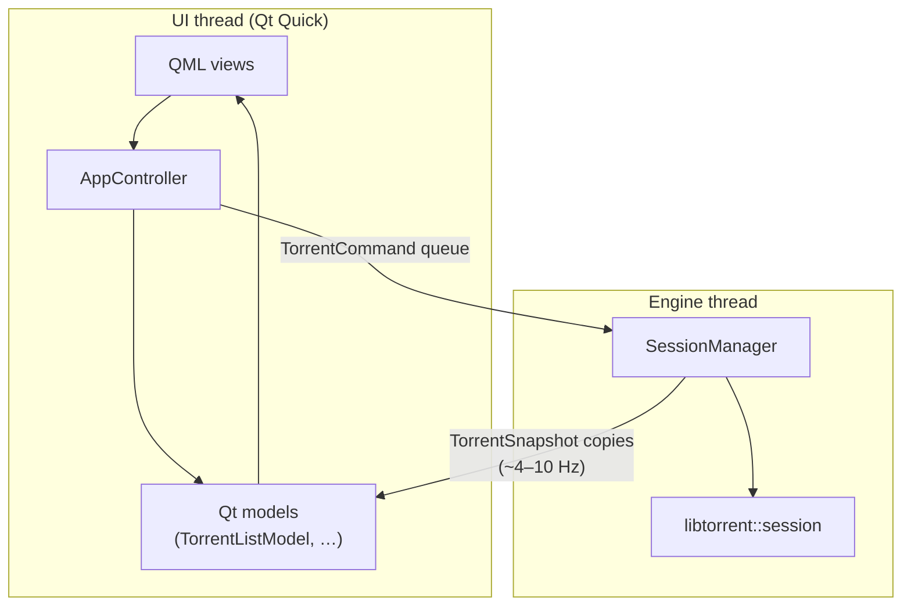

# Torrin architecture

Torrin is a desktop BitTorrent client: **Qt 6 Quick** UI, **libtorrent 2.x** engine, **C++20**. The engine has **no Qt dependency**; the UI never touches libtorrent types directly.

## Diagram

## Layers

| Layer | Path | Role |
|-------|------|------|
| **torrin** | `src/app/` | `main`, `AppController`, QML |
| **torrin_models** | `src/models/` | List/files models fed to QML |
| **torrin_core** | `src/core/` | `SessionManager`, commands, snapshots |

Public C++ API: `include/torrin/`.

## Rules (do not break)

1. **All libtorrent calls on the engine thread** — UI posts `TorrentCommand` values only.
2. **QML uses snapshots** — no `torrent_handle` or other libtorrent types in QML.
3. **`torrin_core` must not include Qt** — enforced by `scripts/check-core-no-qt.sh`.
4. **Presentation in QML** — business logic stays in C++; `Theme.qml` holds design tokens.

## Build and release

- Local dev: `./scripts/bootstrap.sh` then `cmake --preset dev`.
- Tag `v*` runs `.github/workflows/release.yml` (macOS `.dmg`, Windows `.zip`, Linux `.tar.gz`).
- Details: [runbooks/release.md](runbooks/release.md).

## Privacy

No bundled telemetry. Settings and session state stay on disk under the user profile. See [SECURITY.md](../SECURITY.md).
