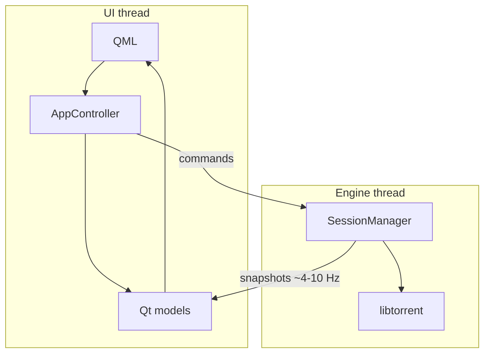

# Torrin architecture

Desktop BitTorrent client: **Qt 6 Quick** UI, **libtorrent 2.x**, **C++20**. The engine has **no Qt**; the UI never uses libtorrent types directly.

## Diagram



## Code layout

| Layer | Path |
|-------|------|
| App + QML | `src/app/` |
| Models | `src/models/` |
| Engine | `src/core/` |
| Public API | `include/torrin/` |

## Rules

1. Libtorrent only on the engine thread (`TorrentCommand` queue from UI).
2. QML sees snapshots only — no `torrent_handle`.
3. `torrin_core` must not include Qt (`scripts/check-core-no-qt.sh`).
4. Logic in C++; QML is presentation (`Theme.qml` for tokens).

## Build

```bash
./scripts/bootstrap.sh
cmake --preset dev && cmake --build --preset dev
ctest --preset dev
```

Presets: `dev` (daily), `ci-release` (packages), `sanitize` (ASan). Toolchain: `vcpkg.json` + `CMakePresets.json`.

## Release

Before tagging: `./scripts/verify.sh`, bump `include/torrin/version.hpp`, `CMakeLists.txt`, `vcpkg.json`, and `CHANGELOG.md`.

```bash
git tag v1.0.0 && git push origin v1.0.0
```

Tag `v*` runs `.github/workflows/release.yml` (macOS `.dmg`, Windows `.zip`, Linux `.tar.gz`, checksums, cosign; ~30–90 min).

Optional local package: `cmake --preset ci-release && cmake --build --preset ci-release`, then `scripts/package-macos.sh` (or `-windows`/`-linux`) with `build/ci-release`.

## Privacy

No bundled telemetry. See [SECURITY.md](../SECURITY.md).
