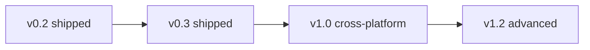

# Torrin — product plan

Planning for work **after the current release**. Shipped behavior: [PRODUCT.md](../specs/PRODUCT.md) and [CHANGELOG.md](../../CHANGELOG.md). Tracking: [ROADMAP.yaml](../tracker/ROADMAP.yaml).

---

## Shipped baseline (v0.1 → v0.2)

| Area | Shipped |
|------|---------|
| Core | Magnet / `.torrent` add, pause, resume, remove, fast-resume, filters, settings |
| v0.2 | Stop / resume seeding, recheck / reannounce, detail metrics, file priorities, AMOLED dark theme, UI revamp |
| v0.3 | List search/sort, ETA, Finder/magnet actions, pause/resume all, shortcuts, resizable UI, list toolbar |

### v0.3 (shipped) {#daily-convenience}

Search, sort (name / date created), ETA in rows, Reveal in Finder, copy magnet, pause/resume all, keyboard shortcuts, free-space line, resizable split, list toolbar UX. **Deferred to v0.4:** export `.torrent`, low-disk alerts, onboarding, multi-select — [ROADMAP.yaml](../tracker/ROADMAP.yaml) milestone `v0-4-convenience-backlog`.

---

## Theme A — Production macOS distribution {#production-macos}

**Goal:** Builds macOS users can install without Gatekeeper friction.

| ID | Item | Description |
|----|------|-------------|
| A-1 | Developer ID signing | Sign `Torrin.app` and `.dmg` |
| A-2 | Notarization | `notarytool` submit + staple |
| A-3 | Hardened runtime | Entitlements for libtorrent / Qt |
| A-4 | In-app updates | Sparkle or equivalent |
| A-5 | Privacy policy (release) | Public doc: local data, no telemetry |

**Milestone:** **v1.1** (after v1.0 cross-platform ship)

---

## Theme B — Cross-platform clients {#cross-platform}

**Shipped in v1.0:** Windows `.zip`, Linux `.tar.gz`, multi-OS CI — [ADR-006](../architecture/ADR-006-cross-platform-release.md).

| ID | Item | Status |
|----|------|--------|
| B-1 | Windows CI + portable zip | Shipped |
| B-2 | Linux CI + portable tar.gz | Shipped |
| B-3 | Multi-OS CI on PR/main | Shipped |
| B-4 | Platform-native open/save | Planned |
| B-5 | Platform tray / notifications | Planned |
| B-6 | Windows MSI / Linux deb or AppImage | Planned |

---

## Theme D — Advanced torrent control {#torrent-advanced}

| ID | Item |
|----|------|
| D-1 | Tracker editor |
| D-2 | Queue limits |
| D-3 | Seed ratio limit |
| D-4 | Seed time limit |
| D-5 | Categories / tags |
| D-6 | Watch folder |
| D-7 | Scheduled bandwidth |
| D-8 | IP blocklist |
| D-9 | Peer list detail |
| D-10 | RSS auto-download |
| D-11 | Bulk file priority rules |
| D-12 | Rich add-torrent summary |
| D-13 | Torrent health score |

**Milestone:** **v1.2**

---

## Theme E — UI and experience {#ui-polish}

| ID | Item |
|----|------|
| E-1 | Native completion notifications |
| E-2 | Menu bar / tray mini UI |
| E-3 | Transfer graphs |
| E-4 | Column customization |
| E-5 | Compact list density |
| E-6 | Localization |

**Milestones:** E-1–E-2 with v0.3 / v1.0; E-3–E-6 with v1.2+

---

## Theme F — Quality, ops, and trust {#trust-ops}

| ID | Item |
|----|------|
| F-1 | Crash reporting (opt-in) |
| F-2 | Automated UI tests |
| F-3 | Supply-chain hardening |
| F-4 | Performance profiling |
| F-5 | Session export / import |

---

## Theme G — Optional / ambitious {#optional-extras}

| ID | Item |
|----|------|
| G-1 | Remote control (LAN Web UI) |
| G-2 | Remote over Tailscale |
| G-3 | Streaming server |
| G-4 | Plugins / scripts |
| G-5 | Statistics dashboard |

**Milestone:** **v1.3+**

---

## Sequencing

Update [ROADMAP.yaml](../tracker/ROADMAP.yaml) when milestone status changes.
