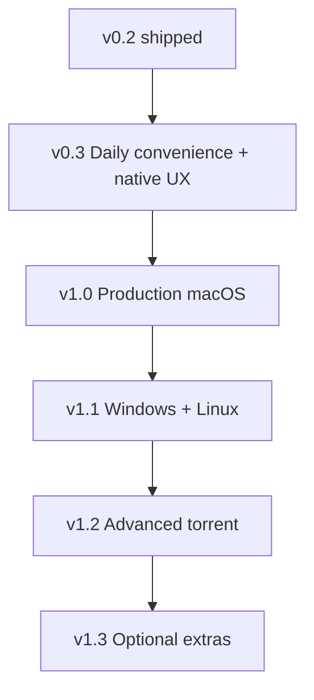

# Torrin — product plan

Planning document for work **after v0.2**. Shipped behavior is in [PRODUCT.md](../specs/PRODUCT.md) and [CHANGELOG.md](../../CHANGELOG.md). Machine-readable tracking: [ROADMAP.yaml](../tracker/ROADMAP.yaml).

Implementation order may change; dependencies are noted per item.

---

## Shipped baseline (v0.1 → v0.2)

Reference only — not scheduled again.

| Area | Shipped |
|------|---------|
| Core | Magnet / `.torrent` add, pause, resume, remove, fast-resume, filters, settings (limits, port, DHT, proxy) |
| v0.2 | Stop / resume seeding, force recheck / reannounce, detail metrics (peers, ETA, ratio), file priorities + per-file progress, add-torrent file checklist, AMOLED-style dark theme, UI revamp |

---

## Theme A — Production macOS distribution {#production-macos}

**Goal:** Builds macOS users can install without Gatekeeper friction.

| ID | Item | Description | Depends on |
|----|------|-------------|------------|
| A-1 | Developer ID signing | Sign `Torrin.app` and `.dmg` with Apple Developer ID Application | Apple dev account |
| A-2 | Notarization | `notarytool` submit + staple ticket on release artifacts | A-1 |
| A-3 | Hardened runtime | Entitlements documented; align with libtorrent / Qt needs | A-1 |
| A-4 | In-app updates | Sparkle or equivalent auto-update channel for tagged releases | A-2 |
| A-5 | Privacy policy (release) | Public doc: local data paths, no telemetry by default | Docs |

**Outcome milestone:** **v1.0** — installable on a clean Mac without “unidentified developer” warnings.

---

## Theme B — Cross-platform clients {#cross-platform}

**Goal:** Same core engine and feature set on Windows and Linux.

| ID | Item | Description | Depends on |
|----|------|-------------|------------|
| B-1 | Windows CI + installer | `windeployqt`, MSVC or MinGW matrix, smoke tests | vcpkg Qt on Windows |
| B-2 | Linux CI + package | AppImage or `.deb`; Wayland / X11 Qt Quick | CI matrix expansion |
| B-3 | Re-enable CI matrix | Restore Windows / Ubuntu jobs trimmed for v0.1 (see ADR-005) | B-1, B-2 |
| B-4 | Platform-native open/save | File dialogs and default folders per OS | UI pass |
| B-5 | Platform tray / notifications | Menu bar or system tray and completion alerts per OS | B-1 or B-2 |

**Outcome milestone:** **v1.1** — published Windows and Linux artifacts.

---

## Theme C — Daily convenience {#daily-convenience}

**Goal:** High-impact features for everyday use without heavy engine changes.

| ID | Item | Description | Depends on |
|----|------|-------------|------------|
| C-1 | Search torrent list | Filter sidebar list by name, info hash fragment, save path | Model / proxy filter |
| C-2 | Sort torrent list | Sort by name, progress, down/up speed, added date, size | Model roles |
| C-3 | ETA in list row | Show time remaining or Paused / Done in each row | Snapshot fields |
| C-4 | Reveal in Finder | Open download folder or highlight file on disk | `QDesktopServices` |
| C-5 | Copy magnet link | Copy `magnet:?…` for selected torrent | Engine metadata |
| C-6 | Export `.torrent` | Save a `.torrent` file for re-sharing | libtorrent export |
| C-7 | Pause all / Resume all | Global session controls in menu or toolbar | Session API |
| C-8 | Disk space warning | Show free space on save volume; warn when low before / during download | `QStorageInfo` |
| C-9 | First-run onboarding | Default download folder, brief network / seeding tips | QML wizard |
| C-10 | Multi-select actions | Select several torrents; pause, resume, remove, tag | List selection model |
| C-11 | Keyboard shortcuts | Space pause/resume, Delete remove, Cmd+F search, etc. | QML / `Shortcut` |

**Outcome milestone:** **v0.3** — list and workflow polish for daily macOS use.

---

## Theme D — Advanced torrent control {#torrent-advanced}

**Goal:** Power-user features expected in mature desktop clients.

| ID | Item | Description | Depends on |
|----|------|-------------|------------|
| D-1 | Tracker editor | View, add, remove trackers on an active torrent | libtorrent handle API |
| D-2 | Queue limits | Max active downloads and uploads; queue order | Session settings |
| D-3 | Seed ratio limit | Stop seeding when ratio reached (per torrent or global) | Session + handle flags |
| D-4 | Seed time limit | Stop seeding after N hours / days | Session + handle flags |
| D-5 | Categories / tags | User labels; filter list by tag | Model + persistence |
| D-6 | Watch folder | Auto-add `.torrent` files dropped in a watched directory | Filesystem watcher + ADR |
| D-7 | Scheduled bandwidth | Time-of-day profiles for rate limits | Settings + timer |
| D-8 | IP blocklist | Optional peer blocklist load / update; clear UX | libtorrent filters + privacy doc |
| D-9 | Peer list detail | Per-torrent peers: IP, client, flags, down/up rates | libtorrent peer info |
| D-10 | RSS auto-download | Subscribe to feeds; rules for auto-add | New subsystem + ADR |
| D-11 | Bulk file priority | Patterns: “video only”, “skip samples/subs”, select by extension | Files tab + rules engine |
| D-12 | Add-torrent summary | Rich pre-add panel: total size, file count, trackers, comment | Preview API (extend existing) |
| D-13 | Torrent health score | Simple green / yellow / red from peers, trackers, errors | Heuristic on snapshot |

**Outcome milestone:** **v1.2** — feature-complete for power users on macOS.

---

## Theme E — UI and experience {#ui-polish}

**Goal:** Visual polish and native feel beyond the functional shell.

**Shipped:** Telegram-inspired tokens; sidebar filters; detail hero, speed cards, segmented Overview / Files; context action chips; AMOLED dark theme.

| ID | Item | Description | Depends on |
|----|------|-------------|------------|
| E-1 | Native macOS notifications | Notification Center when a download completes (app in background) | Qt Platform / UNUserNotificationCenter |
| E-2 | Menu bar / tray icon | Background operation; quick pause / resume / open app | macOS integration |
| E-3 | Transfer graph | Speed history sparkline in detail pane (down / up) | Metrics ring buffer in engine or UI |
| E-4 | Sequential preview / play | Open or stream first file while downloading (sequential mode) | Sequential download + OS open |
| E-5 | Theme schedule (optional) | Auto light / dark by time of day | Appearance settings |
| E-6 | In-app notification polish | Stack, dismiss, click-to-focus torrent | Existing banner component |

**Outcome milestone:** Bundled across **v0.3** (E-1, E-2) and **v1.2** (E-3–E-6) by priority.

---

## Theme F — Trust and operations {#trust-ops}

**Goal:** Sustainable maintenance and user trust.

| ID | Item | Description | Depends on |
|----|------|-------------|------------|
| F-1 | Dependency automation | Dependabot or Renovate for vcpkg baseline + Actions | CI green |
| F-2 | Crash reporting | Opt-in crash logs (no torrent names / content) | Privacy review |
| F-3 | Privacy policy | What is stored locally (resume data, settings, paths) | Docs + site |
| F-4 | Localization | Qt `.ts` files; at least one non-English locale | UI string freeze |
| F-5 | Threat model updates | Document new surfaces (RSS, remote, blocklist) as they ship | security/ |

**Outcome milestone:** Ongoing; **F-3** targets **v1.0** release.

---

## Theme G — Optional / ambitious {#optional-extras}

**Goal:** Differentiators for later releases; higher cost or niche audience.

| ID | Item | Description | Depends on |
|----|------|-------------|------------|
| G-1 | Remote control | LAN-only Web UI or companion API to pause / list torrents | HTTP server + auth ADR |
| G-2 | Remote over Tailscale | Optional secure access outside LAN | G-1 + docs |
| G-3 | Streaming server | Built-in HTTP range server for media files | libtorrent + HTTP |
| G-4 | Plugins / scripts | User hooks on complete (e.g. run script) | Sandboxed exec ADR |
| G-5 | Statistics dashboard | Session totals: downloaded / uploaded all-time | Persistent metrics store |

**Outcome milestone:** **v1.3+** — pick one vertical (e.g. G-1) per release.

---

## Suggested sequencing

| Phase | Themes | Rationale |
|-------|--------|-----------|
| **Next** | C, E-1, E-2 | Fast user-visible wins on current macOS build |
| **v1.0** | A, F-3 | Trust to distribute broadly |
| **v1.1** | B | Audience expansion |
| **v1.2** | D, E-3–E-6 | Power users and polish |
| **v1.3+** | G, F-1–F-2, F-4–F-5 | Optional depth and maintenance |

**Recommended immediate focus:** **Theme C** (search, sort, Reveal in Finder, pause all) plus **E-1 / E-2** (notifications, menu bar).

Update [ROADMAP.yaml](../tracker/ROADMAP.yaml) when a milestone moves from `planned` → `in_progress` → `done`.
