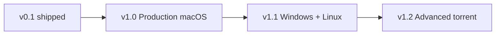

# Torrex — next major work

Planning document for work **after v0.1**. Implementation order may change; dependencies are noted.

## Theme A — Production macOS distribution {#production-macos}

**Goal:** Ship builds macOS users can install without Gatekeeper friction.

| Item | Description | Depends on |
|------|-------------|------------|
| Developer ID signing | Sign `Torrex.app` and `.dmg` with Apple Developer ID Application | Apple dev account |
| Notarization | `notarytool` submit + staple ticket on release artifacts | Signing |
| Hardened runtime | Entitlements documented; align with libtorrent/Qt needs | Signing |
| Sparkle or in-app updates | Optional auto-update channel for tagged releases | Notarized DMG |

**Outcome milestone:** **v1.0** tagged release installable on a clean Mac without “unidentified developer” warnings.

---

## Theme B — Cross-platform clients {#cross-platform}

**Goal:** Same core engine and feature set on Windows and Linux.

| Item | Description | Depends on |
|------|-------------|------------|
| Windows CI + installer | `windeployqt`, MSVC or mingw matrix, smoke tests | vcpkg Qt on Windows |
| Linux CI + package | AppImage or `.deb`; Wayland/X11 Qt Quick | CI matrix expansion |
| Re-enable CI matrix | Restore Windows/Ubuntu jobs trimmed for v0.1 (see ADR-005) | Per-platform packaging |
| Platform-native open/save | File dialogs and default folders per OS | UI pass |

**Outcome milestone:** **v1.1** with published Windows and Linux artifacts.

---

## Theme C — Advanced torrent control {#torrent-advanced}

**Goal:** Power-user features expected in mature clients.

| Item | Description | Depends on |
|------|-------------|------------|
| Per-file progress | Show % complete per file in Files tab | Engine file progress API |
| Piece picker / selective download | UI to choose files before download starts | Add-torrent params |
| Tracker editor | View/add/remove trackers on existing torrent | libtorrent handle API |
| Queue and global caps | Max active downloads, seed ratio limits | Session settings |
| RSS / watch folder | Auto-add torrents from folder or feed | New subsystem + ADR |

**Outcome milestone:** **v1.2** feature-complete for daily desktop use.

---

## Theme D — UI and experience {#ui-polish}

**Goal:** Polish beyond the v0.1 functional shell.

| Item | Description | Depends on |
|------|-------------|------------|
| Native macOS notifications | `UNUserNotificationCenter` or Qt Labs Platform | Production signing optional |
| Tray icon and menubar | Background operation, quick pause/resume | macOS integration |
| Search and sort | Torrent list search, sort by name/progress/speed | Model changes |
| Transfer graph | Speed history sparkline in detail pane | Metrics ring buffer |
| Onboarding | First-run download folder and network tips | QML only |

**Outcome milestone:** Bundled with **v1.0** or **v1.2** depending on priority.

---

## Theme E — Trust and operations {#trust-ops}

**Goal:** Sustainable maintenance and user trust.

| Item | Description | Depends on |
|------|-------------|------------|
| Dependency automation | Dependabot or Renovate for vcpkg baseline + Actions | CI green matrix |
| Crash reporting | Optional opt-in crash logs (no torrent content) | Privacy review |
| Privacy policy | What is stored locally (resume files, settings path) | Docs |
| Localization | Qt translation files; at least one non-English locale | UI freeze window |

---

## Suggested sequencing

**Recommended next focus:** **Theme A (Production macOS)** if you plan to share builds widely; **Theme B** if you need Windows/Linux first.

Update [ROADMAP.yaml](../tracker/ROADMAP.yaml) when a milestone moves from planned to in progress.
